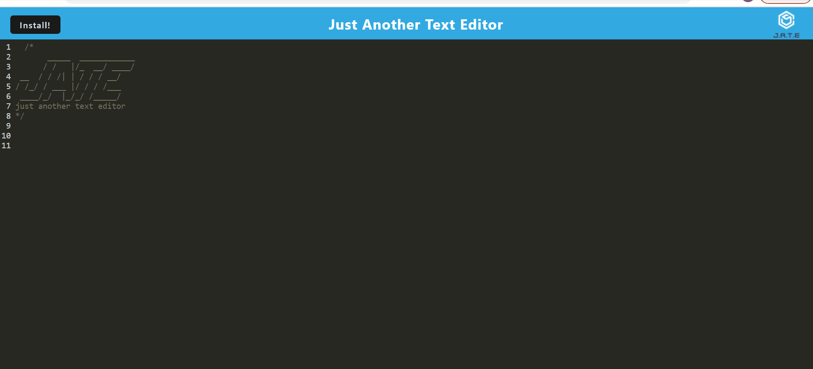

# text-editor
Progressive web application: text editor

## Technology Used 

| Technology Used         | Resource URL           | 
| ------------- |:-------------:| 
| HTML    | [https://developer.mozilla.org/en-US/docs/Web/HTML](https://developer.mozilla.org/en-US/docs/Web/HTML) | 
| CSS     | [https://developer.mozilla.org/en-US/docs/Web/CSS](https://developer.mozilla.org/en-US/docs/Web/CSS)      |   
| JavaScript | [https://developer.mozilla.org/en-US/docs/Web/JavaScript](https://developer.mozilla.org/en-US/docs/Web/JavaScript)     |    
| Git | [https://git-scm.com/](https://git-scm.com/)     | 
| Node.js | [https://nodejs.org/en](https://nodejs.org/en)     | 
| Express.js | [https://expressjs.com/](https://expressjs.com/)     | 
| IndexDB | [https://www.npmjs.com/package/idb](https://www.npmjs.com/package/idb)     | 
| Webpack | [https://webpack.js.org/](https://webpack.js.org/)     | 
## Description 

[Visit the Deployed Site](https://youtu.be/BFyeuLhjcPY)

Downloadable text editor that can be used on and offline 

## Table of Contents 

* [Installation](#Installation)
* [Usage](#usage)
* [Learning Points](#learning-points)
* [Author Info](#author-info)
* [Credits](#credits)
* [License](#license)

## Installation 
To install this application either click the install button on the page or the install button provided in your browser
To install this applications dependencies type npm i into your terminal. 

## Usage 

This app can be used to take notes, write paper, and just generally any other type of text. 

## Learning Points 
This project was a great introduction to what React does for us under the hood.  
* bundling 
* Webpack
* IndexDB
* caching 
* service workers 

## Author Info

### Shea Schwennicke 

* [Portfolio](https://sheaschwenn.github.io/Portfolio/)
* [LinkedIn](https://www.linkedin.com/in/shea-schwennicke-76a378210/)
* [Github](https://github.com/sheaschwenn)

## License
MIT License 

For more information refer to the LICENSE section in the repo

---